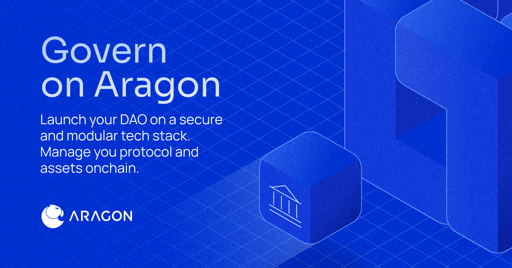

<html>

We build full-stack DAO technology that enables organizations to easily and securely govern their protocols and assets onchain.

The Aragon Project was the first DAO framework to launch in web3. Since 2016, Aragon has consistently pushed the boundaries of social and technological innovation, tackling new approaches to support onchain organizations today and well into the future.

<h3>Resources</h3>
<ul>
  <li><a href="https://docs.aragon.org/">Developer Portal</a>: Start building by exploring the Aragon OSx smart contract framework, our core governance plugins, and tools for our governance stack.</li>
  <li><a href="https://app.aragon.org">App</a>: For a no-code solution to create and manage your organization, our in-house application is an easy starting point.</li>
  <li><a href="https://dune.com/aragonproject/aragon-app-multichain-main-dashboard">Dune Analytics</a>: Dashboard showing performance metrics and usage statistics for OSx contracts and their governed protocols.</li>
</ul>

  
  

  <body>
    

      
  
 
      
 <a href="https://x.com/aragonproject">  
 
     
 <a href="https://blog.aragon.org">   

    

  </body>
  

</html>